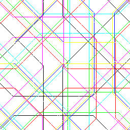

# cf.rs

[CFRS[]](https://github.com/susam/cfrs) in Rust.


## Installation

```sh
cargo install cfrs
```

For library users:

```sh
cargo add cfrs
```

## Usage

### Animated GIF

```sh
cfrs out.gif '[[[[[[[[[[FS]]]]R]]RR]]RRCC]][[[[[[[[S]]]]]]]]'
```


### Static Images

> All formats supported by [`image`](https://github.com/image-rs/image) crate should work.

```sh
cfrs out.bmp '[[[[[[[[[[F]]]]R]]RR]]RRCC]]'
cfrs out.jpg '[[[[[[[[[[F]]]]R]]RR]]RRCC]]'
cfrs out.png '[[[[[[[[[[F]]]]R]]RR]]RRCC]]'
cfrs out.webp '[[[[[[[[[[F]]]]R]]RR]]RRCC]]'
```


### Image Dimensions

Default dimensions are 256x256. You can specify custom dimensions using `--width` and `--height` flags.

```sh
cfrs --width 512 --height 512 out.gif '[[CC[C[C[[[[[[[[[[[F]]]]]][[[R[[[[[[F]]R[[F]]]]]]]]]RS][[R]]]]R]]]RF]]][[[[[[[S]]]]]]]'
```


### Background Color

You can specify the background color using `--background` flag.

```sh
cfrs --background white out.bmp '[[[CR[[[[[[[[[[F]]]]FF]FF]FF]R]FF]FF]FF]FFR]FF]'
```


